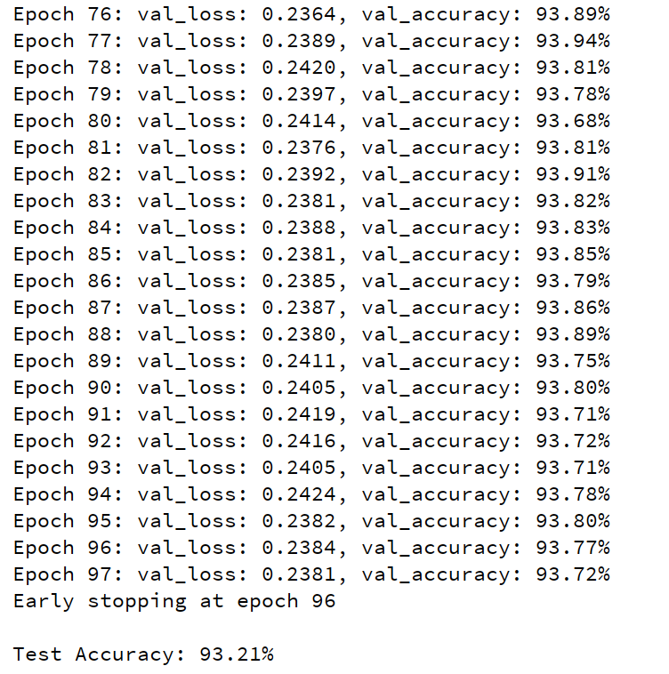
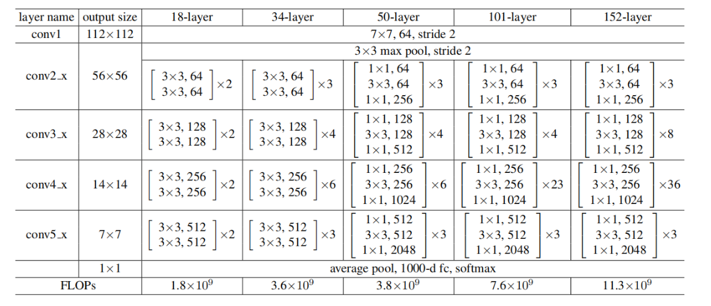

# Task 1 ResNet18实现

## 简述
**任务**
- 实现一个基本的Resnet-18网络
- 使用Resnet-18网络完成分类任务，并汇报指标
- （选做）实现易复用，延展性好的Resnet网络模型的代码

**项目结构**

- `Basic_Resnet18.py`
	ResNet18 for CIFAR-10
- `Block.py`
	BasicBlock 实现（18/34）
	Bottleneck 实现（50/101）
- `ResNet.py`
	- ResNet 实现， 可延展至18/34/50/101
- `CIFAR10_classification.py`
	- 将 ResNet18 用于 CIFAR-10 图像分类
- data
	- CIFAR-10 数据集
- assets
	- results
	- tensorboard
- `README.md`
## CIFAR-10 Classification（ResNet-18）
### 1. 背景与目标

- 任务：**图像分类**。将 32×32 **彩色**图像划分到 **10** 类(*airplane、automobile、bird、cat、deer、dog、frog、horse、ship、truck*)。
	- 共60000张，分为10类，每类6000张图
	- train:50,000, batch_size=10000, batch=5
	- test:10,000, 每一类随机抽取1,000张
	- dimension (3, 32, 32)
  
- 评价指标：**loss, accuracy** 
  
- 目标：基于 ResNet-18（CIFAR-stem）在标准增强下得到稳定的结果。
### 2. 网络结构
#### 2.1 BasicBlock
- 卷积核大小、BN、激活函数
- 残差连接方式（恒等映射 / 1x1 卷积降采样）

#### 2.2 ResNet-18 层次组织
- Conv1: 7x7 卷积 + BN + ReLU + MaxPool
- Layer1: 2 × BasicBlock (64)
- Layer2: 2 × BasicBlock (128)
- Layer3: 2 × BasicBlock (256)
- Layer4: 2 × BasicBlock (512)
- AvgPool → FC
### 3. 实验记录
#### 3.1 训练设置
```python
# set parameters  
config = {  
    'seed': 42,  # random seed
    'batch_size': 128, # 256 for valid_set and test_set
    'learning_rate': 0.1,  
    'n_epochs': 200,  
    'momentum': 0.9,  
    'weight_decay': 5e-4,  
    'num_classes': 10,  
    'num_workers': 2,  
    'early_stop': 20,  # patience
    'valid_ratio': 0.2,  
}
```
- **Dataset** 
	- CIFAR-10
		- dimension (3, 32, 32)-RGB
- **optimizer**
```python
optimizer = optim.SGD(model.parameters(), lr=config['learning_rate'], momentum=config['momentum'], weight_decay=config['weight_decay'])  
# decay lr
scheduler = torch.optim.lr_scheduler.StepLR(optimizer, step_size=30, gamma=0.1)
```
- **Loss function**
`criterion = nn.CrossEntropyLoss()`

#### 3.2 结果指标

使用自实现的 ResNet-18 在 CIFAR-10 上设置训练 200 轮，采用 StepLR，最终取得 **93.72%** 的验证准确率与 **0.238** 的验证损失。训练准确率达 **99.95%**，与验证准确率存在约 **6.2%** 的泛化差距，表现为轻中度过拟合。学习率在第30轮的下降显著改善了验证集表现，后续阶段趋于稳定。



- Loss 曲线
	- `train/loss`,`val/loss`
- Accuracy 曲线
	- `train/acc, val/acc`
- 最终测试集准确率
	- `val_loss: 0.238, val_accuracy: 93.72%`
---
## ResNet 系列实现
提供一个可复用、可扩展的 ResNet 实现。



### 设计

- 两类残差块
	- `BasicBlock(expansion=1)`:两层 3×3， 供 18/34使用
	- `Bottleneck(expansion=4)`:1×1 -> 3×3 -> 1×1
- 配置块
	- 18 -> `[2, 2, 2, 2]` BasicBlock
	- 34 -> `[3, 4, 6, 3]` BasicBlock
	- 50 -> `[3, 4, 6, 3]` Bottleneck
	- 101 -> `[3, 4, 23, 3]` Bottleneck
- 工厂函数
```python
def resnet18(num_classes=1000):  
    return ResNet(BasicBlock, [2, 2, 2, 2], num_classes=num_classes)  
  
def resnet34(num_classes=1000):  
    return ResNet(BasicBlock, [3, 4, 6, 3], num_classes=num_classes)  
  
def resnet50(num_classes=1000):  
    return ResNet(Bottleneck, [3, 4, 6, 3], num_classes=num_classes)  
  
def resnet101(num_classes=1000):  
    return ResNet(Bottleneck, [3, 4, 23, 3], num_classes=num_classes)
```
### 快速开始
```python
from ResNet import resnet18, resnet50
import torch

x = torch.randn(2, 3, 224, 224)

m18 = resnet18(num_classes=1000)
m50 = resnet50(num_classes=1000)

logits18 = m18(x)  # [2, 1000]
logits50 = m50(x)  # [2, 1000]
```
### 形状与参数量自检
运行`ResNet.py`末尾的`test_resnet()`函数，可以得到以下结果。
- 构建 18 与 50 两个模型
- 前向检查输出形状
- 统计参数量
- 前向-反向-优化步骤，确保梯度可计算


由于测试时使用的是10类分类，而非原论文的ImageNet 1000类的标准统计，因此总参数量是基本正确的。
### 最小代码示例
**构建层组`_make_layer`**
```python
def _make_layer(self, block, out_channels, blocks, stride=1):  
    downsample = None  
    if stride != 1 or self.in_channels != out_channels * block.expansion:  
        downsample = nn.Sequential(  
            nn.Conv2d(self.in_channels, out_channels * block.expansion, kernel_size=1, stride=stride, bias=False),  
            nn.BatchNorm2d(out_channels * block.expansion),  
        )  
  
    layers = []  
    # only focus on the first block  
    layers.append(block(self.in_channels, out_channels, stride, downsample))  
    self.in_channels = out_channels * block.expansion  
    # the rest blocks  
    for _ in range(1, blocks):  
        layers.append(block(self.in_channels, out_channels, stride=1, downsample=None))  
    return nn.Sequential(*layers)
```

**Bottleneck的通道扩展**
```python
class Bottleneck(nn.Module):  
    expansion = 4  
    # Bottleneck block for ResNet-50/101  
    def __init__(self, in_channels, out_channels, stride=1, downsample=None):  
        super(Bottleneck, self).__init__()  
        mid_channels = out_channels  
  
        # 1x1 convolution to reduce dimensions  
        self.conv1 = nn.Conv2d(in_channels, mid_channels, kernel_size=1, bias=False)  
        self.bn1 = nn.BatchNorm2d(mid_channels)  
  
        # 3x3 convolution  
        self.conv2 = nn.Conv2d(mid_channels, mid_channels, kernel_size=3, stride=stride, padding=1, bias=False)  
        self.bn2 = nn.BatchNorm2d(mid_channels)  
  
        # 1x1 convolution to restore dimensions  
        self.conv3 = nn.Conv2d(mid_channels, out_channels * self.expansion, kernel_size=1, bias=False)  
        self.bn3 = nn.BatchNorm2d(out_channels * self.expansion)  
  
        self.relu = nn.ReLU(inplace=True)  
        self.downsample = downsample
```
## Reference
- [ResNet原理 · GitBook](https://www.rethink.fun/chapter11/ResNet%E5%8E%9F%E7%90%86.html)
- [CIFAR10 — Torchvision main documentation](https://docs.pytorch.org/vision/master/generated/torchvision.datasets.CIFAR10.html)
- [CIFAR-10图像分类（基于PyTorch）](https://blog.csdn.net/ft_sunshine/article/details/90644818?ops_request_misc=%257B%2522request%255Fid%2522%253A%252259e3b90cc9b1fde21acdf153126b61ac%2522%252C%2522scm%2522%253A%252220140713.130102334..%2522%257D&request_id=59e3b90cc9b1fde21acdf153126b61ac&biz_id=0&utm_medium=distribute.pc_search_result.none-task-blog-2~all~top_positive~default-1-90644818-null-null.142^v102^pc_search_result_base6&utm_term=cifar-10%E5%9B%BE%E5%83%8F%E5%88%86%E7%B1%BB&spm=1018.2226.3001.4187)
- [权重衰减 · GitBook](https://www.rethink.fun/chapter9/%E6%9D%83%E9%87%8D%E8%A1%B0%E5%87%8F.html)