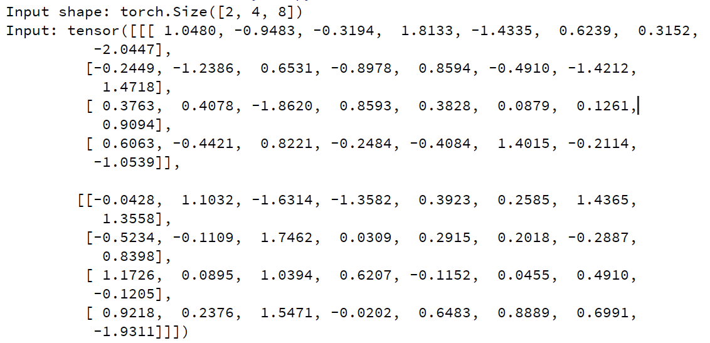
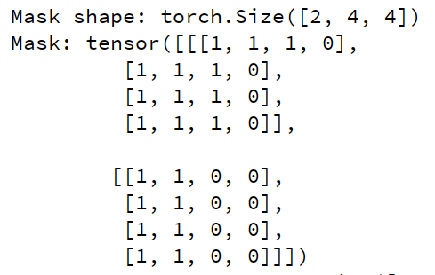
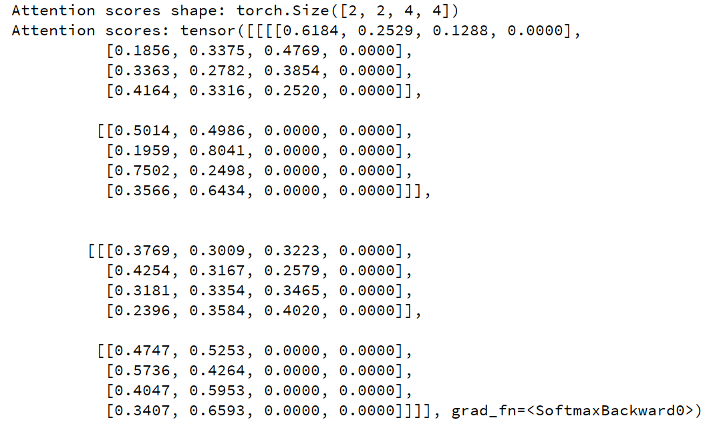
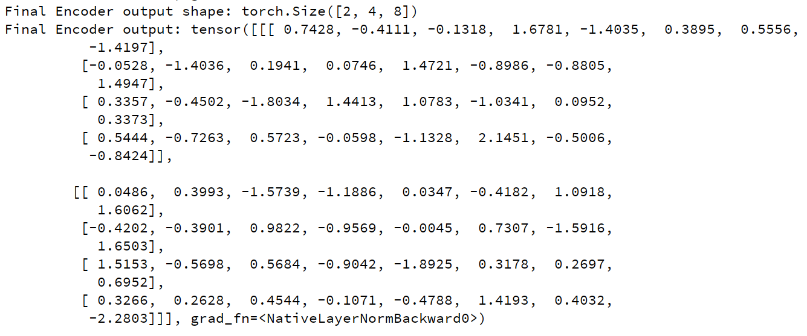

# Task 2 Transformer Encoder
- 实现 *Self-Attention, Multi-Head Attention, Add&Norm, Feed Forward*，并堆叠为 *Encoder*。

- 输入随机矩阵进行测试。

## 项目结构

- `Self_Attention.py`
	- Scaled Dot-Product Attention 
	- Self-Attention Block  
- `Multi_Head_Attention.py`
	- 多头拆分、拼接与输出线性层，处理多头注意力
- `Add_Norm.py`
	- 包含AddNorm 和 FFN 的实现
	- 残差 + LayerNorm + Dropout
- `Encoder.py`
	- `EncoderLayer` 与堆叠的 `Encoder`
	- 测试参数配置二，检查输入、输出维度

## 测试
测试使用参数
```python
# 打印 encoder 第一层各过程张量
config_test_1 = {  
    "batch_size": 2,  
    "seq_len": 4,  
    "d_model": 8,  
    "num_heads": 2,  
    "d_ff": 16,  
    "num_layers": 2
    "dropout": 0.1  
}

# transformer base
# 检查输入、输出的维度变化
config_test_2 = {  
    "batch_size": 2,  
    "seq_len": 10,  
    "d_model": 512,  
    "num_heads": 8,  
    "d_ff": 2048,  
    "num_layers": 6,  
    "dropout": 0.1  
}
```
在 *Pycharm* 的*Python* 控制台检测各张量的维度变化，结果符合原预期。

### 结果

**输入随机矩阵**



**Padding mask**



**注意力权重矩阵**



**输出结果**



## Reference

- [注意力机制 · GitBook](https://www.rethink.fun/chapter13/%E6%B3%A8%E6%84%8F%E5%8A%9B%E6%9C%BA%E5%88%B6.html)
- [注意力机制 · GitBook](https://www.rethink.fun/chapter15/%E6%B3%A8%E6%84%8F%E5%8A%9B%E6%9C%BA%E5%88%B6.html)
- [2021 - 自注意力机制 (Self-attention) (下) | 李宏毅机器学习](https://www.bilibili.com/video/BV1Wv411h7kN?spm_id_from=333.788.videopod.episodes&vd_source=47dbec3f3db6a86044a31f482a95d4f0&p=39)
- [GPT是什么？直观解释Transformer](https://www.bilibili.com/video/BV13z421U7cs/?spm_id_from=333.337.search-card.all.click)
